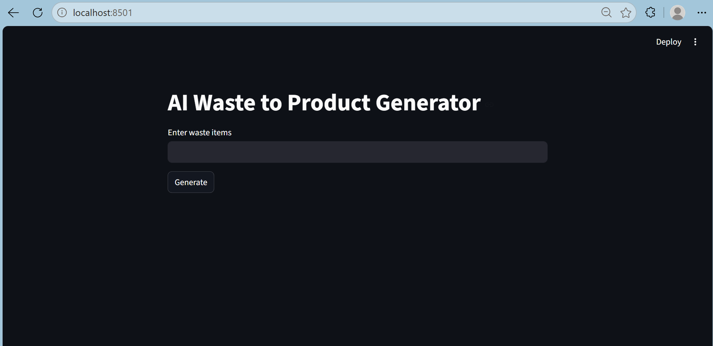
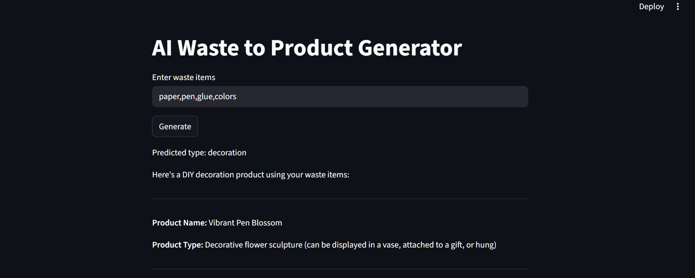
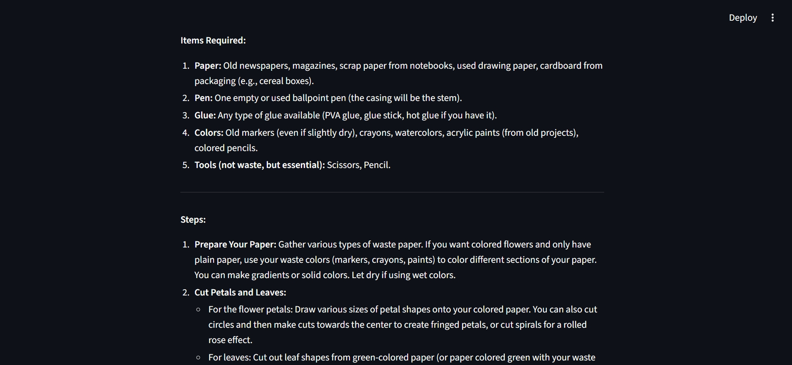
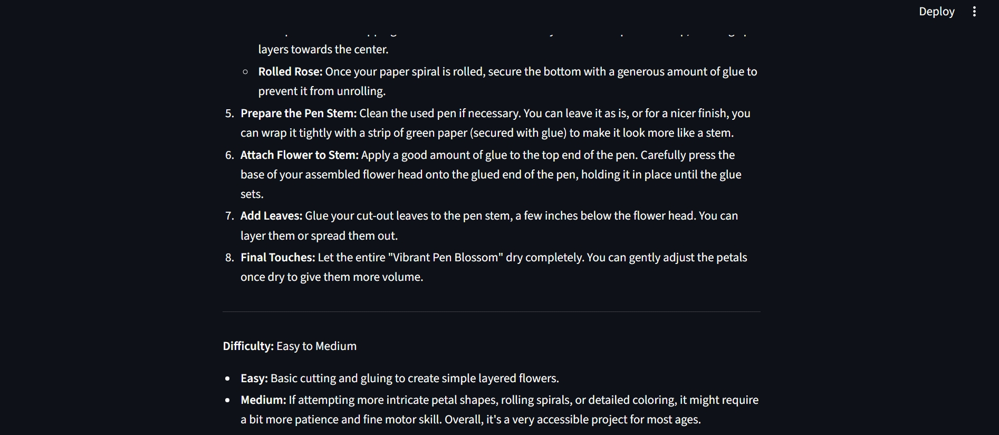

# ♻️ DIY Waste Craft Generator

An AI-powered web application that transforms waste materials into creative DIY craft ideas using image understanding and generative AI. Users upload an image of waste items, and the system analyzes the object and generates innovative reuse suggestions with guided instructions.

This project encourages sustainable practices by helping users convert everyday waste into useful and creative products.

---

## 📌 Problem Statement

Large amounts of household waste such as plastic bottles, cardboard, jars, newspapers, and containers are discarded daily despite having potential for reuse. People often lack ideas on how these materials can be repurposed.

DIY Waste Craft Generator solves this problem by using AI to suggest creative craft ideas from waste materials.

---

## 🚀 Features

- Upload image of waste material
- AI-based image understanding
- Generates DIY craft suggestions
- Provides step-by-step guidance
- User-friendly interface
- Promotes recycling and sustainability
- Real-time generation of ideas

---

## 🛠 Tech Stack

### Frontend
- HTML
- CSS
- JavaScript

### Backend
- Python
- Flask

### AI Components
- OpenAI API / Generative AI
- Prompt Engineering
- Image Processing

---
## 📊 Custom Dataset Creation

A custom dataset was created specifically for this project instead of relying entirely on publicly available datasets.

The dataset includes various waste materials collected and organized manually, such as:

- Plastic bottles
- Cardboard items
- Glass jars
- Newspapers
- Tin cans
- Household recyclable waste

The collected data was cleaned, categorized, and prepared for AI processing to improve the relevance and quality of generated DIY craft suggestions.

This approach helped create a more domain-specific dataset tailored for waste-to-craft idea generation.

## ⚙️ Working Procedure

The system follows the workflow below:

1. User uploads an image of a waste item  
2. Image is processed by the system  
3. AI identifies or understands the object  
4. Prompt is generated dynamically  
5. Generative AI creates suitable DIY ideas  
6. Results are displayed with instructions  

---

## 📂 Project Structure

```bash
DIY-Waste-Craft-Generator/
│
├── static/               # CSS, JavaScript, assets
├── templates/            # HTML pages
├── uploads/              # User uploaded images
├── app.py                # Main Flask application
├── requirements.txt      # Required libraries
├── utils/                # Helper functions
└── README.md
```

---

## 💻 Installation

Clone repository:

```bash
git clone https://github.com/adityasingh353/DIY-Waste-Craft-Generator.git
```

Move into project directory:

```bash
cd DIY-Waste-Craft-Generator
```

Install dependencies:

```bash
pip install -r requirements.txt
```

Run application:

```bash
python app.py
```

Open browser:

```bash
http://localhost:5000
```

---

## 🌱 Sample Inputs

- Plastic Bottle
- Cardboard Box
- Old Newspaper
- Glass Jar
- Tin Can

### Example Outputs

- Pen Stand
- Decorative Lamp
- Flower Vase
- Storage Organizer
- Wall Decoration

---

## 🔮 Future Enhancements

- Multi-language support
- Video tutorial generation
- Voice-based interaction
- Mobile application deployment
- Craft difficulty recommendations

---

## 📸 Screenshots


### Home Page



### Generated Results





 


---

## 👨‍💻 Created By

Aditya Singh  

## 📜 License

This project is developed for educational and learning purposes.

---

⭐ If you found this project useful, consider starring the repository.